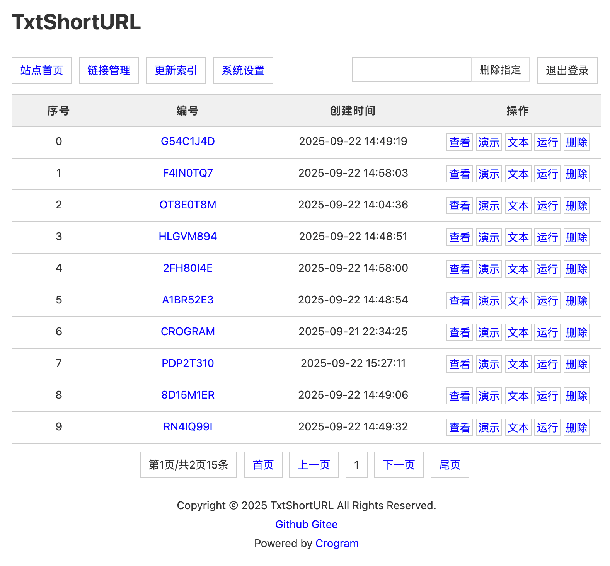
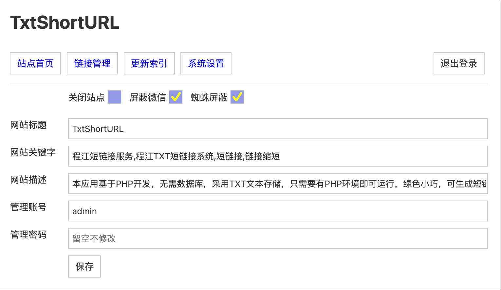

# TxtShortURL

## 系统简介

本应用基于 PHP 开发的链接缩短系统，无需数据库，采用 TXT 文本存储，只需要有 PHP 环境即可运行，

绿色小巧，可生成短链、可储存文本，用于 URL 转发，展示演示页面等。

支持屏蔽蜘蛛/屏蔽微信浏览器，登陆后请在后台设置新的密码

## 安装说明

1. 将压缩包直接放入网站根目录解压即可，网站迁移直接打包传到目标服务器解压即可
2. 后台地址 /admin，管理员账号：admin，密码：123456

演示网址：http://rentry.usite.pub

## 链接使用示例

```
跳转链接：http://rentry.usite.pub/s.php?u=CROGRAM
查看链接：http://rentry.usite.pub/ss.php?u=CROGRAM
文本链接：http://rentry.usite.pub/txt.php?u=CROGRAM
演示链接：http://rentry.usite.pub/run.php?u=CROGRAM
```

## 源码目录文件介绍

```
index.php 首页文件，异步调用接口生成短链
api.php   生成并储存数据的接口文件
  s.php   系统自行判断输出类型，转发 URL 或输出文本，文本时在带页面样式
 ss.php   系统自行判断输出类型，转发 URL 或无样式输出内容，可充当接口
txt.php   系统强制输出文本内容，无转发和样式
run.php   可以做前端演示页面用，点击运行演示代码

admin/    后台管理
data/     数据目录
includes/ 系统文件

data/txt/ 存放链接数据的目录，以文本形式储存。
data/config.php  系统配置文件
data/indexes.php 后台管理索引文件
```

## 截图预览







